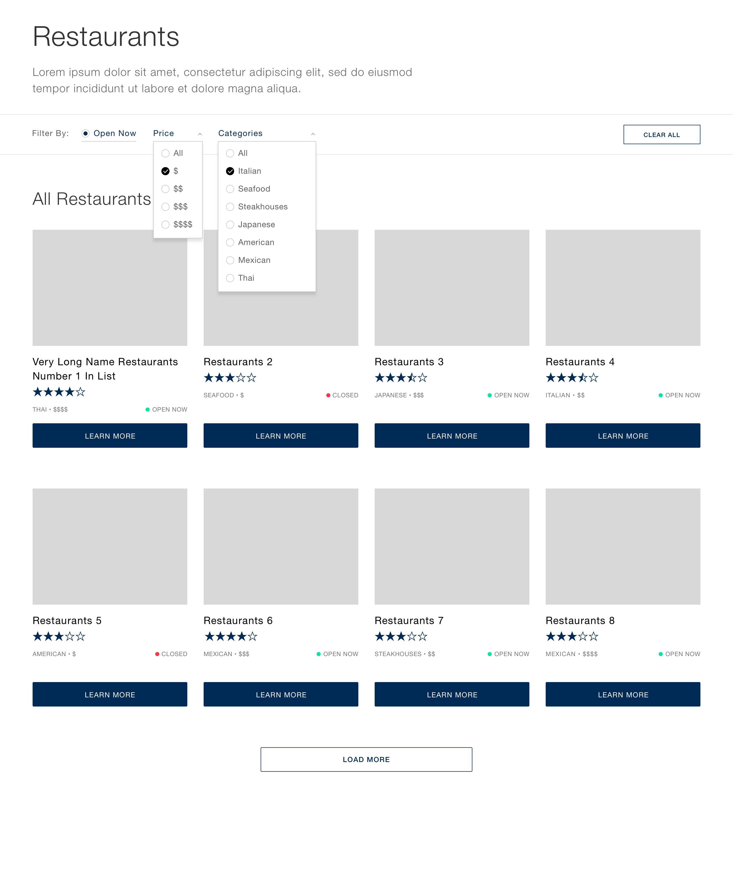

# Superformula Front-end Developer Coding Test

Be sure to read **all** of this document carefully, and follow the guidelines within.

## Context

Use HTML, CSS, and JavaScript to implement the following mock-up. You will need to leverage an open API for restaurant data to fill in the details and functionality as described below. You are only required to complete the desktop views, unless otherwise instructed.



Use this Sketch file to see button states, colors, and responsive design.

> [Source Sketch file](Superformula-FE-test-ff1d5ca.sketch)

## Requirements

### Zomato API

You will need to [sign up for an API key](https://developers.zomato.com/api), or you can ask us and we will provide you ours to use for your PR.

### Page Structure

```
Main
  - Filter navigation
    - Open now (client side filter)
    - Price (client side filter)
    - Categories/Cuisines (server side search filter)
  - Section
    - Restaurant item
      - Image (use `thumb`)
      - Cuisine / Categories (use `cuisines` and split string to show only 1)
      - Price range
      - `*`Open / Closed (based on restaurants timezone)
      - Restaurant name
      - `*`Excerpt
      - `*`Book button
      - Learn more (open modal to show more details)
```

> `*` may not be available from the API

### Functionality

- The filter navigation needs to be able to perform real time filtering on both client side data, as well as server side queries.
- `Categories` can be pre-filled from the [Cuisines endpoint](https://developers.zomato.com/documentation#!/common/cuisines)
- The items should always show 4-6 items per row depending on viewport size. Use your own judgement for when to change per breakpoints.
- Please see the [Zomato documentation](https://developers.zomato.com/documentation) for more details.

### Tech stack

- JS oriented
  - Use **React**.
  - _Do not_ use any React boilerplate, such as Create React App
  - Use CSS or Less/SASS/SCSS or any **CSS** framework as you like.

### Bonus

- Also create mobile version included in Sketch comp.
- Write clear **documentation** on how the app was designed and how to run the code.
- Provide proper unit tests.
- Provide components in [Storybook](https://storybook.js.org) with tests.
- Write concise and clear commit messages.
- Provide an online demo of the application.

## What We Care About

Use any libraries that you would normally use if this were a real production App. Please note: we're interested in your code & the way you solve the problem, not how well you can use a particular library or feature.

_We're interested in your method and how you approach the problem just as much as we're interested in the end result._

Here's what you should strive for:

- Good use of current HTML, CSS, and JavaScript & performance best practices.
- Solid testing approach.
- Extensible code.

## Q&A

> Where should I send back the result when I'm done?

Fork this repo and send us a pull request when you think you are done. There is no deadline for this task unless otherwise noted to you directly.

> What if I have a question?

Just create a new issue in this repo and we will respond and get back to you quickly.
